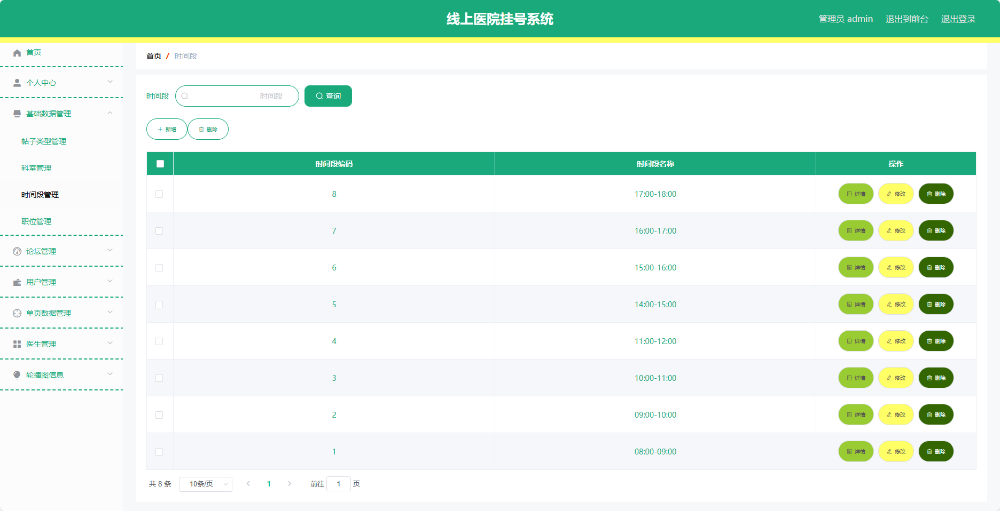
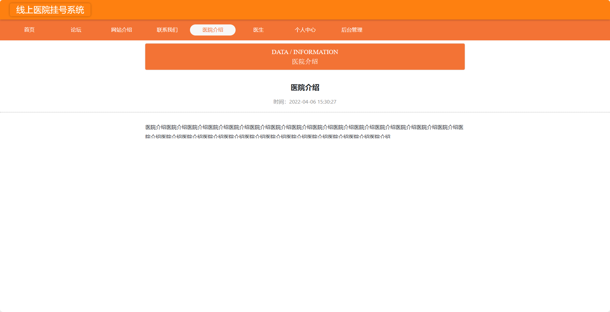
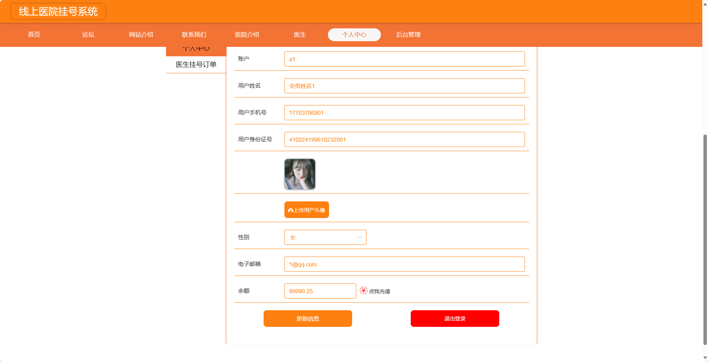
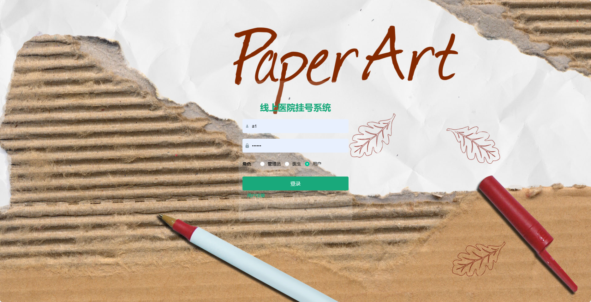
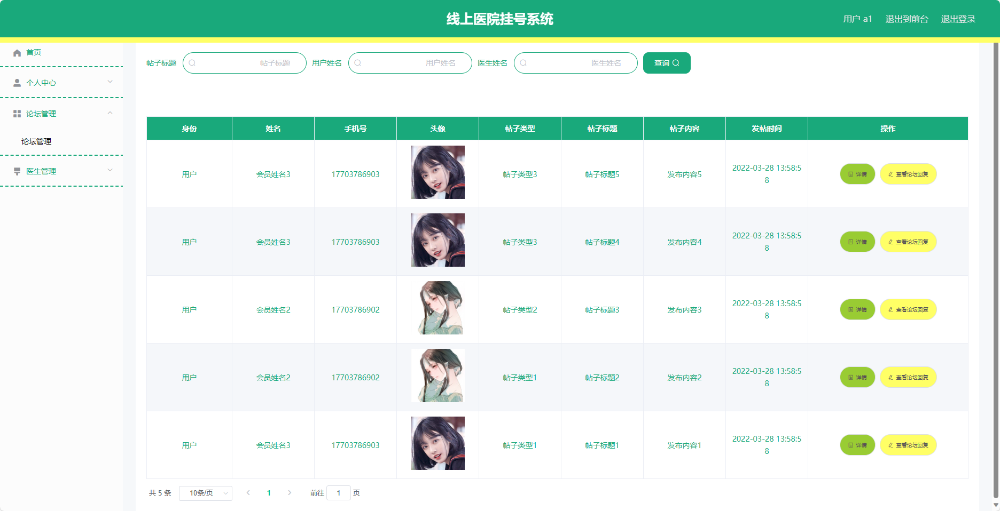

## 基于SpringBoot的线上医院挂号系统(程序+报告)

###  获取sql数据库文件: 从戎源码网 (https://armycodes.com/) QQ: 386869957 QQ群: 377586148
###  所有系统地址: (https://github.com/YuLin-Coder/AllProjectCatalog) 
###  所有项目以及源代码本人均调试运行无问题 可支持远程安装部署调试、定制修改、代码讲解

## 项目介绍
基于SpringBoot的线上医院挂号系统，系统包含三种角色：管理员、医生、用户,系统分为前台和后台两大模块，主要功能如下。

### 【管理员】:
1. 个人中心：管理个人信息。
2. 基础数据管理：管理基础数据，包括科室信息、医院信息等。
3. 论坛管理：对论坛帖子进行管理，包括查看、删除、置顶等操作。
4. 用户管理：管理注册用户信息，包括查看、冻结、删除用户等操作。
5. 单页数据管理：管理网站单页信息，如网站介绍、联系方式等。
6. 医生管理：管理医生信息，包括添加、编辑、删除医生信息。
7. 轮播图信息：管理首页轮播图信息，包括添加、编辑、删除轮播图等操作。

### 【用户】:
1. 个人中心：管理个人信息。
2. 论坛管理：管理论坛帖子，包括查看、删除、置顶等操作。
3. 医生管理：管理医生信息，包括添加、编辑、删除医生信息。

### 医生：
1. 个人中心：管理个人信息。
2. 论坛管理：管理医生在论坛上的帖子，包括查看、删除、回复等操作。
3. 医生管理：管理医生个人资料，包括编辑个人介绍、排班信息等。
4. 医生留言管理：管理患者给医生的留言信息，包括查看、回复等操作。
5. 医生挂号订单管理：管理患者对医生的挂号订单，包括查看、处理、取消订单等操作。

### 【前台】:
1. 首页：展示医院的相关信息，包括新闻公告、特色科室等内容。
2. 论坛：用户可以在论坛上进行讨论和交流。
3. 网站介绍：展示医院网站的介绍和相关信息。
4. 联系我们：提供联系方式和在线留言功能。
5. 医院介绍：详细介绍医院的历史、规模、荣誉等信息。
6. 医生：用户可以查看医生的排班信息和专业领域，以便选择合适的医生进行挂号。
7. 个人中心：用户可以管理个人信息、挂号记录、订单状态等。

## 项目技术
- 编程语言：Java
- 数据库：MySQL
- 项目管理工具：Maven
- 前端技术：HTML、CSS、JavaScript、Jquery、Vue
- 后端技术：Spring、SpringMVC、MyBatis

## 运行环境
- JDK版本：JDK1.8及以上
- 开发工具：IDEA、Ecplise、Myecplise都可以
- 数据库: MySQL5.7及以上
- Maven：maven3.0及以上
- Node：14.14.0及以上

## 运行截图

